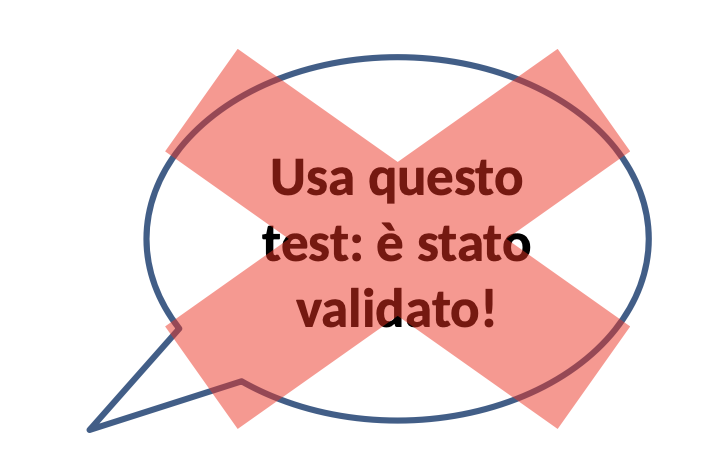
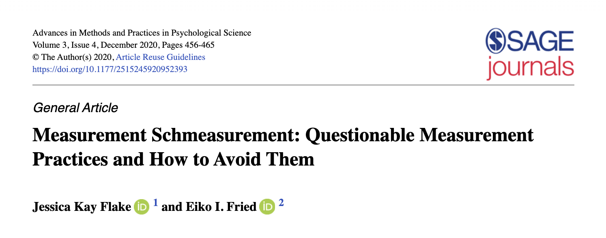
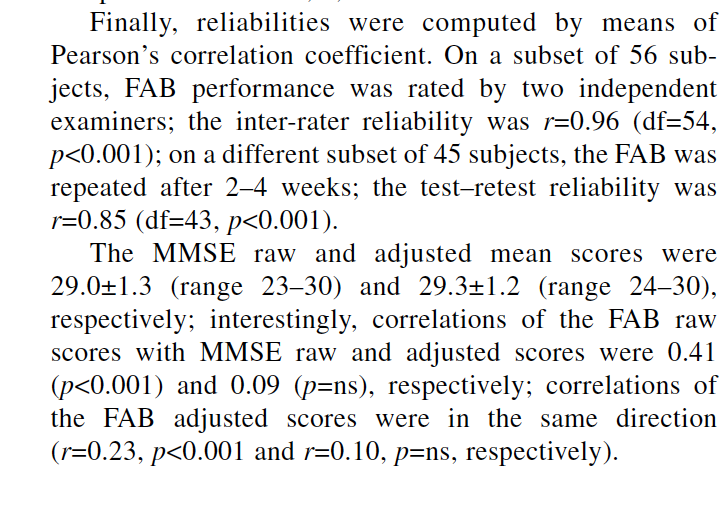
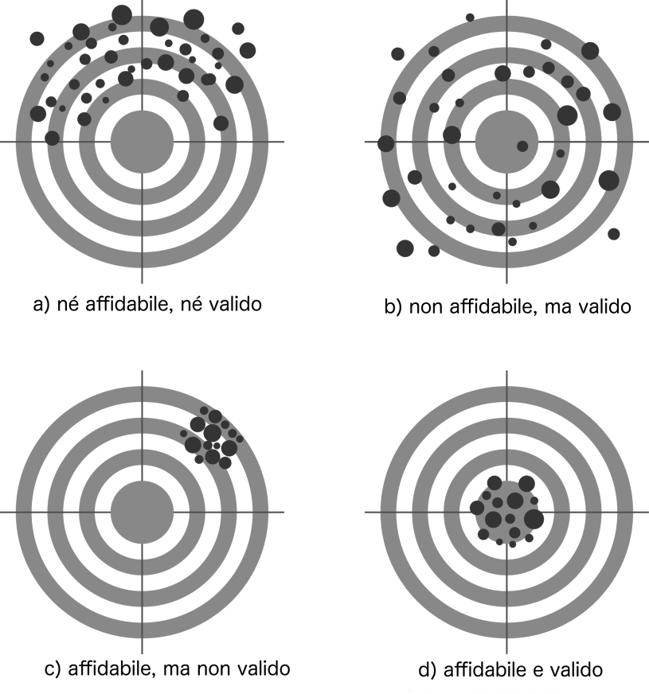

<!-- the section below is shown only if rendering is beamer from latex. (and format:revealjs is commmented) -->

::: {.content-visible when-format="beamer"}
```{=latex}
% TITLE SLIDES
\title{Metodi Statistici per la Neuropsicologia Forense\\ \vspace{1em} \small \emph{4a. Validità e affidabilità (teoria)}}
\author{Giorgio Arcara,\\ Università di Padova \\ IRCCS San Camillo, Venezia}

\titlegraphic{

\vspace*{7cm}
\includegraphics[scale=0.15]{Figures/LogoSanCamilloIRCCS_Unipd_alpha.png}
\hfill \includegraphics[scale=0.15]{Figures/CC_license_3_0.png}
}
\maketitle
```
:::

# Validità e affidabilità

## Validità e Affidabilità

```{=latex}
\small
\begin{columns}
\column{0.8\textwidth}
Validità e affidabilità sono due qualità fondamentali dei test (non solo didatticamente).
\column{0.2\textwidth}
\begin{figure}
\includegraphics[scale=0.05]{Figures/triangle.png}
\end{figure}
\end{columns}

\vfill

```
Nelle prossime slides farà una panoramica generale senza scendere nei dettagli delle formule che vedremo in un passo successivo.

## Validità e affidabilità
Usare un test senza conoscerne validità e affidabilità può portare a grossi errori:


Per dare un'analogia (estrema): usare un test con bassa affidabilità e nessuna validità per un'interpretazione potrebbe portare a misurare l’altezza di una persona con una bilancia che ha un margine di errore di 10 kg.

**Dal momento che i test sono strumenti di misurazione non possiamo prescindere dal conoscerne le loro qualità.**


## Validità e affidabilità (brevi definizioni)

La **validità** è la qualità di un test di misurare effettivamente il costrutto che vuole misurare.

L’ **affidabilità** indica la precisione di un test.


## Come vorremmo fossero Validità e Affidabilità (ma non sono)
**Validità**: il mio test misura il mio costrutto in maniera nota e quantificabile. Es.:

- l’80% del punteggio osservato è riconducibile al costrutto di interesse.
- Altri costrutti non di interesse possono contribuire facendo variare di +5% o -5% del punteggio.

\vfill
\pause

**Affidabilità**: il mio test misura il mio costrutto con precisione quantificabile. Es.:

- il mio punteggio finale può essere sbagliato di +/-3
- il punteggio finale può essere sbagliato di +/-5%

## Come vorremmo fossero Validità e Affidabilità (ma non sono)
Anche se ci sono dei criteri talvolta di soglia minima (di affidabilità o validità) non c'è un'unanimità sui criteri per considerare un test adeguato, spesso questi valori ci aiutano a distinguere test tra di loro, per scegliere il migliore (o il meno peggiore)

\vfill

```{=latex}
\begin{center}
\begin{tikzpicture}[baseline=(current bounding box.center)]


% : peggio - meglio
\node[anchor=west] at (0, 1) {\small \parbox{3cm}{\emph{Peggiore Affidabilità \\e/o Validità}}};
\node[anchor=east] at (10, 1) {\small \parbox{3cm}{\emph{Migliore Affidabilità \\e/o Validità}}};


\node[anchor=west] at (0, -1.2) {\textbf{Peggio}};
\node[anchor=east] at (10, -1.2) {\textbf{Meglio}};
\draw[thick] (1.5, -1.2) -- (8.5, -1.2);

\end{tikzpicture}
\end{center}
```

# Validità

## Parlare correttamente di validità

La validità è la qualità di un test di misurare ciò che effettivamente vuole misurare. Il termine validità è sempre riferito ad un **utilizzo** che si fa dei punteggi.
\vfill \pause
Non ha senso dire che **un test è valido**
\vfill \pause

```{=latex}
\begin{center}
\tikz[baseline=(t.base)]{
  \node[inner sep=0pt, outer sep=0pt, anchor=base] (t)
    {\emph{"usa questo test! è stato validato!"}};
  \draw[red, thick] ([yshift=0.4em]t.south west) -- ([yshift=0.4em]t.south east);
}
\end{center}
```

## Un concetto da ribadire
{width="50%" fig-align="center"}

## La Validità
Un test può avere validità per un certo utilizzo o per più utilizzi.

La validità non è una qualità tutto-o-nulla, ma una qualità lungo un continuum

Ad esempio ci sono evidenze che il _”Free and Cued Selective Reminding Test-it”_ (Clerici et al., 2017) è un test con buona validità per misurare le capacità di memoria.

## La Validità (non dimostrata)

talvolta, alcuni test non riportano nessuna evidenza di validità. Si tratta di strumenti in cui non abbiamo la certezza di cosa stiano misurando.

## Tipi di validità

Il libro adotta la cornice più recente e autorevole, quella degli _Standards for Educational and Psychological Testing_ (AERA, APA, & NCME, 2014): la validità è un **concetto unitario**, valutato attraverso 5 fonti di evidenza. Manteniamo però le etichette classiche, più diffuse nei manuali e articoli di test neuropsicologici:

- Validità di contenuto
- Validità convergente/divergente (validità di costrutto)
- Validità di criterio
- Validità ecologica
- (+ validità di facciata: concetto storico, vedi slide a parte)

<br>
Per un approfondimento sulle classificazioni più classiche vedi Urbina (2004), Essentials of Psychological Testing.

## Validità a priori e a posteriori

La validità è distinta anche in _a priori_ e _a posteriori_
La validità a priori è quella che si può esaminare prima che si abbiano dati empirici sul test.
(lo sono, la validità di facciata e la validità di contenuto). La validità a posteriori è invece quella che si può valutare solo quando sono disponibili dati sul test (lo sono la validità di costrutto, la validità di criterio e la validità ecologica.)

## Validità di facciata 1/2 (nota storica)

**Validità di facciata**: la qualità di un test di apparire chiaramente riconducibile al costrutto che vuole misurare, sulla base di un giudizio qualitativo. Es. un test di memoria che richiede di ricordare gli items.

Il termine non compare nemmeno una volta negli _Standards_ (AERA, APA, & NCME, 2014, oltre 230 pagine): è trattato qui come un concetto storico, non come un'evidenza tecnica di validità.

Data la natura prettamente qualitativa non esistono analisi per verificarla.

## Validità di facciata 2/2

La plausibilità di una misurazione non è sufficiente per giudicare se effettivamente stiamo misurando quello che ci interessa.





## Validità di contenuto 1/2

**Validità di contenuto**: la proprietà degli item di essere sufficienti ed adeguati per valutare il costrutto di interesse. Può essere valutata qualitativamente o quantitativamente (Lawshe, 1975).

\vfill

Spesso non è riportata nei test o c’è solo una valutazione qualitativa. Due test che riportano validità di contenuto quantitativamente sono Abaco (Sacco et al., 2008) e APACS (Arcara & Bambini, 2016), ma non usano statistiche inferenziali.

## Validità di contenuto 2/2

_Esempio di test con scarsa validità di contenuto_:

Un test che vuole misurare l’abilità di lettura nella vita quotidiana e utilizza solamente parole in isolamento.

\vfill
_Esempio di test con buona validità di contenuto:_

Un test che vuole misurare le abilità di guida. E simula le abilità di guida tramite un sorta di videogioco in numerose condizioni.

## Evidenze basate sui processi di risposta

Una fonte di evidenza poco nota nei test neuropsicologici riguarda i **processi** con cui si arriva a un risultato, non solo il risultato stesso.

_Esempio_: in un test di memoria di parole il paziente usa una _mnemotecnica_ non prevista — la performance può essere buona, ma non riflette più il costrutto che il test intende misurare.

\vfill
Si investiga tramite interviste, tempi di risposta, movimenti oculari. Storicamente collegata al _Boston Process Approach_ (Kaplan, 1988).

## Validità di costrutto (convergente/divergente) 1/5
**Validità convergente-divergente (o validità di costrutto)**: indaga quanto il test misura effettivamente il costrutto che intende misurare valutando coerenza interna degli item, oppure correlazione con altri test.
Si parla anche di validità “divergente” perché valuta anche la qualità di non correlare con test con cui non dovrebbe correlare (ad esempio un test specifico per memoria visuospaziale, dovrebbe non correlare troppo con memoria verbale).

## Validità di costrutto (convergente/divergente) 2/5
A livello di analisi di dati.
Per la coerenza degli items di un test tra loro si usa l’analisi fattoriale o indici di consistenza interna (per questi vedi sezione affidabilità).

\vfill

Per la relazione dei punteggi totali con quelli di altri test si usano spesso correlazioni.
Non esistono delle regole su che valori (nell’analisi fattoriale, o nelle correlazioni) siano accettabili. Dipende dal costrutto misurato e dalle relazioni attese.

## Validità di costrutto (convergente/divergente) 3/5

Un test con buona validità di costrutto correla con test che misurano lo stesso costrutto o correla con test che misurano altri costrutti in maniera coerente con le aspettative.


_Ad esempio_, un test di memoria di lavoro con buona validità di costrutto, correla con altri test di memoria di lavoro. 

Un test di comprensione di linguaggio figurato (costrutto più ampio), dovrebbe correlare con altri test che misurano lo stesso costrutto, ma in maniera moderata, potrebbe correlare anche con attenzione o altre funzioni cognitive legate.

## Validità di costrutto (convergente/divergente) 4/5

La validità di costrutto è da un lato forse la validità più importante, ma dall’altro quella più difficile da valutare se adeguata quando si indaga in relazione ad altri test che misurano lo stesso costrutto. Questo perché non esistono indicazioni di “correlazione minima” che dovrebbe avere un test con un altro per avere supporto alla sua validità di costrutto.

_Ad esempio_: se sviluppo un nuovo test di memoria, non è detto che ci sia un valore minimo di correlazione con un altro test di memoria che sia considerato come sufficiente.


Per l’analisi fattoriale o il Cronbach’s alpha esistono invece principi più chiari: l’analisi deve mostrare che gli item si comportano in maniera statisticamente adeguata relativamente al costrutto (questo sarà più chiaro nella sezione di approfondimento psicometrico di queste analisi).

## Validità di costrutto (convergente/divergente) 5/5

Quando si utilizzano metodi su validità di costrutto è spesso perché manca un "gold-standard" e cioè una misura che possiamo considerare la migliore misura (una sorta di misura ideale) a cui riferirci. 
Se l'avessimo la validità più appropriata da utilizzare è quella di criterio e il gold-standard è il criterio (vedi prossime slides). 

Il più delle volte non esiste però un test perfetto per un costrutto (es. non esiste un test di memoria che sia considerabile il riferimento), quindi ci si accontenta di evidenze di convergenza. Il mio test di memoria dovrebbe correlare con altre misure di memoria.


## Costrutto vs criterio: una nota terminologica

Secondo gli _Standards_ (AERA, APA, & NCME, 2014), "costrutto" è una nozione ampia che include anche ciò che qui chiamiamo _criterio_.

Come nel libro, in questo corso si preferisce mantenere la distinzione classica: **costrutto** = concetto psicologico inosservabile; **criterio** = variabile osservabile, stabilita indipendentemente dal test (Cronbach & Meehl, 1955).

\vfill
Anche struttura fattoriale e correlazioni convergenti/divergenti, presentate insieme finora come "validità di costrutto", sono in realtà due fonti di evidenza distinte secondo gli _Standards_.

## Validità di criterio 1/3

**Validità di criterio**: La proprietà di un test di fornire risultati legati ad un criterio esterno. Il criterio è una variabile *osservabile* (a differenza dei costrutti). Un criterio è spesso l’appartenenza ad una patologia, oppure un aspetto prognostico (lo sviluppare una patologia in futuro, il migliorare dopo un trattamento, etc.), oppure il punteggio ad un altro test.  

La validità di criterio, se riferita ad una classificazione con un altro punteggio, è spesso espressa in termini di correlazione. Se riferita ad una classificazione in categorie è spesso espressa da valori di sensibilità/specificità (vedremo questo in maniera approfondita in un capitolo dedicato).

Può essere distinta in **concorrente** se il criterio è misurato nello stesso momento, o **predittiva** se lo scopo è predire.

## Validità di criterio 2/3

Dal momento che l'interesse in neuropsicologia/psicologia è il più delle volte nei costrutti la validità di criterio viene utilizzata solo in alcuni casi specifici.

- il criterio è un test più lungo/dispendioso rispetto a quello da valutare (questo avviene per esempio quando si vuole dimostrare che un test breve di screening).
- il criterio è l'appartenenza ad una categoria diagnostica o prognostica o, in generale, a un gruppo che può essere identificato con sufficiente certezza da essere definito "gold-standard".


## Validità di criterio 3/3

In generale sono fornite percentuali che esprimono l’accuratezza del test nel predire il criterio. Non esiste una soglia universale, ma come riferimento indicativo:

- criterio continuo (correlazione): $\geq$ 0.70-0.80
- criterio categoriale (sensibilità/specificità/AUC): $\geq$ 0.80

L'interpretazione dipende sempre da scopo del test, prevalenza della condizione e costi di falsi positivi/negativi.

## Validità ecologica 1/2

Validità ecologica: si riferisce alla qualità di un test di riflettere effettivamente delle abilità che hanno ripercussioni nella vita quotidiana.

(Ad esempio, che la performance deficitaria ad un test di memoria rifletta difficoltà di memoria nella vita quotidiana).

Può essere valutata tramite diverse analisi, es. Correlazioni con altri questionari o scale riferite alla vita quotidiana.

Non esistono valori soglia condivisi che un test deve avere. Nota che la validità ecologica è raramente disponibile vista la difficoltà nell’essere verificata.

## Validità ecologica 2/2

Nota che **la validità ecologica è spesso trascurata** ma particolarmente importante perché spesso nelle valutazioni sono fatte inferenze implicite sull’impatto del deficit sulla vita quotidiana. Identificare un deficit di memoria è infatti relativamente importante _in sé_: quello che è rilevante è spesso capire che impatto ha questo deficit nella vita del paziente

Questo è particolarmente rilevante nel caso di valutazioni del danno subito dal paziente. Avere un deficit cognitivo che sia particolarmente invalidante è ovviamente diverso da avere un deficit che però non ha impatto sulla vita quotidiana.

Un test con dati su validità ecologica ci aiuterebbe a fare queste interpretazioni perché ci sarebbe supporto scientifico sulla relazione tra performance al test e comportamento di vita quotidiana.

## Evidenze basate sulle conseguenze del testing

Una fonte di evidenza, spesso trascurata, riguarda le **conseguenze**, soprattutto non intenzionali, dell'uso di un test.

_Esempio_: un test che classifica sistematicamente in modo diverso persone di diverso stato socioeconomico, penalizzandone alcune nell'accesso a servizi di supporto.

\vfill
Una conseguenza negativa conta come problema di validità solo se è riconducibile a un limite nell'interpretazione dei punteggi (contenuto insufficiente o varianza non legata al costrutto) — non ogni conseguenza negativa implica scarsa validità.

## Come conoscere validità di uno strumento?

```{=latex}
\begin{columns}
\column{0.8\textwidth}
\begin{itemize}
\itemsep1em 

\item Per conoscere la validità di un test occorre documentarsi (manuale, articolo scientifico).

\item Per comprendere gli effetti della validità occorre conoscere degli aspetti (veramente base) di statistica.

\item In italia e nei test neuropsicologici c’è spesso poca attenzione alla validità. Pochi test riportano dati su validità. Il termine \emph{validato} viene in certi casi usato per indicare che sono stati raccolti i dati normativi, un aspetto completamente diverso.
\end{itemize}
\column{0.2\textwidth}
\vspace{7em}
\begin{figure}
\includegraphics[scale=0.05]{Figures/triangle.png}
\end{figure}
\end{columns}
```

## Validità nei test italiani.

```{=latex}
\begin{columns}
\column{0.5\textwidth}

\vspace{2em}

\begin{figure}
\includegraphics[scale=0.4]{Figures/Aiello_table.png}
\end{figure}

\column{0.5\textwidth}
Validità nei test di screening italiani (somministrazione dal vivo).
Aiello et al., 2022. Una cella senza quadratino indica che quel dato non è disponibile.

\vspace{2em}

CV=concurrent validity
CrV=criterion validity
DV=divergent validity

\end{columns}
```

## Un aspetto importante di validità 

\textbf{La validità non è qualità “immutabile” e data di un test}. ma dipende da come lo si utilizza.
Se il test viene utilizzato in maniera inappropriata, allora può non diventare più valido.

L’appropriatezza dell’utilizzo di un test è determinata dall’adesione alle procedure legate all’utilizzo del test stesso. Quanto più devio dalle procedure iniziali e quanto meno valido è il test.

\pause
\textbf{NOTA:} queste considerazioni valgono per ogni strumento di misurazione. Ci sono delle circostanze in cui può non funzionare bene. Queste possono dipendere da ciò che misuriamo o dal nostro non utilizzare in maniera adeguata le procedure che definiscono il test.

## Perdita di Validità 1/3
Esempio da immagine del test "Descrizione di Scene" - APACS

{width="60%" fig-align="center"}

è un test che misura l'efficacia comunicativa, utilizzando come punto di partenza la descrizione di una fotografia.
Viene chiesto di dire dove si è, chi c'è nella figura e cosa si sta facendo.

## Perdita di Validità 2/3
Immaginate di stampare un'immagine con questa definizione.
Oppure che una persona abbia un problema di vista e veda questo.

{width="60%" fig-align="center"}

Stiamo ancora misurando ciò che intendevamo? 

Il test è ancora "valido"?

## Perdita di Validità 1/3
Questo esempio, un po' estremo, mostra come per una serie di ragioni, il test potrebbe non misurare più quello che intendeva.

Idealmente dovremmo usare test che sono meno suscettibili a condizioni in cui la validità è persa.

Il neuropsicologo forense dovrebbe essere attento a identificare se ci sono situazioni che hanno fatto perdere validità al test. Di nuovo questo sottolinea l'importanza dell' _interpretazione_ dei punteggi.

## Esempio 1: MoCA e MMSE

_Per che cosa è valido il MoCA?_

\
Nell'identificare su cosa si basa un test, è comune fare l'errore di basarsi sull'intuito o solo sulla validità di facciata e non su altre prove di validità.

\pause
Nel paper originale Nasreddine et al., 2005. 
Il MoCA era valido per discriminare tra MCI, AD e controlli.

Anche il MMSE (Folstein et al., 1975), nasceva per distinguere Demenze da Depressione, ma è comunemente utilizzato come test generale di funzionamento cognitivo.

## Esempio 2: Frontal Assessment Battery (FAB) 1/2

{width="50%"}


Nell’articolo originale del 2005 (Appollonio et al. 2005) in realtà non ci sono effettive prove di validità. Questo non significa che il FAB-it non abbia prove di validità per misurare funzioni esecutive (le versioni di altre lingue del FAB le hanno), ma che di fatto non ci sono prove per quella italiana.

## Esempio 2: Frontal Assessment Battery (FAB) 2/2


Prove della validità della FAB sono arrivate dopo, nel 2022, Aiello et al., 2022 **sottolineando come la Validità sia un processo continuo di accumulazione di evidenze.**

## Esempio 3: `{\small ABaCo Assessement BAttery for COmmunication}`{=latex} 1/2
Il test ABACo per le valutazioni di capacità comunicative è un esempio di eccellente test riguardo validità.

## Esempio 3: `{\small ABaCo Assessement BAttery for COmmunication}`{=latex} 2/2

```{=latex}
\begin{columns}
\column{0.5\textwidth}
\small
Validità del test ABaCo\\ (Sacco et al., 2008)

\column{0.5\textwidth}
\begin{figure}
\includegraphics[scale=0.3]{Figures/ABACO_validity.png}
\end{figure}
\end{columns}
```

# Affidabilità

## Affidabilità/precisione

L'**Affidabilità** è la qualità di un test di fornire punteggi consistenti in diverse misurazioni: può essere intesa come la **precisione** di un test.

Come per la validità, gli _Standards_ (AERA, APA, & NCME, 2014) trattano l'affidabilità come un **principio unitario** — l'ombrello "affidabilità/precisione" — di cui i "tipi" che seguono sono sfaccettature diverse, non categorie separate.

## Tipi Affidabilità

- Affidabilità inter-rater
- Affidabilità test-retest
- Affidabilità split-half
- Consistenza Interna


Esistono diverse classificazioni di affidabilità. Questa che sto utilizzando è una delle possibili.

## Valori desiderabili

Spesso le misure di affidabilità sono associate a numeri. Le slide seguenti ipotizzerò dei valori desiderabili di affidabilità che un test dovrebbe avere.

È importante che questi sono valori "indicativi" e non esistono reali valori considerati come standard nella letteratura. Per tale ragione spesso circolano test con valori ben più bassi di quelli desiderabili.

## Inter-rater agreement

**Inter-rater agreement** (affidabilità inter-rater): è una misura della consistenza con cui diversi esaminatori valutano la stessa prestazione dello stesso paziente. È legata alla chiarezza delle istruzioni su come attribuire i punteggi e alla complessità dei comportamenti osservati nel test — ed è collegata al concetto di **oggettività** del test (vedi Cornice teorica).

Esistono vari modi di calcolarla. Nel metodo più diffuso è espressa da un coefficiente, l'intraclass correlation (ICC) — una **famiglia** di coefficienti — che varia tra 0 e 1, dove 0 indica completa inconsistenza tra i punteggi e 1 indica assoluta consistenza tra i punteggi di due o più esaminatori.

Valori maggiori a 0.60 sono desiderabili (Cicchetti & Sparrow, 1981; Fastenau et al., 1996).

## Affidabilità test-retest 1/4

**Affidabilità test-retest**: la consistenza dei punteggi ottenuti dalle stesse persone in due occasioni diverse, assumendo che non ci sia stato un cambiamento _reale_ nel costrutto misurato e che le condizioni di somministrazione siano comparabili.

In genere è espressa da un coefficiente di correlazione che varia tra -1 e 1, ma può essere anche espressa dal coefficiente ICC (lo stesso usato per Inter-rater agreement).

valori maggiori a 0.70 sono desiderabili

## Affidabilità test-retest 2/4

Nota che l’affidabilità test-retest è sempre valutate con uno specifico intervallo (es. 1 mese). Per tale ragioni esistono infinite possibili affidabilità test-retest, dal momento che questo valore potrebbe variare a seconda dell’intervallo.

Generalmente, più corto è l’intervallo, più è probabile sia alta l’affidabilità test-retest.

## Affidabilità test-retest 3/4


```{=latex}
\begin{columns}
\column{0.8\textwidth}
\small
\textbf{Se misurata con correlazione, l'affidabilità test-retest \textbf{non indica la stabilità del punteggio dei test nel tempo, o la possibilità di usarlo per fare valutazioni nel tempo.}} 

\column{0.2\textwidth}
\begin{figure}
\includegraphics[scale=0.05]{Figures/triangle.png}
\end{figure}
\end{columns}
```

La correlazione cattura infatti solo la **consistenza relativa** (l'ordine relativo delle persone si mantiene), non un accordo assoluto sui valori — per questo va sempre affiancata da un'analisi dei cambiamenti sistematici (es. confronto delle medie; vedi Arcara \& Bambini, 2016).

## Affidabilità test-retest 4/4

Quando è usata la correlazione come misura, i punteggi potrebbero avere un'affidabilità test-retest (correlazione) di 0.98, ma essere poco stabili perché soggetti a _variazioni sistematiche_.

\pause
Più nello specifico. L’affidabilità test retest misurata tramite correlazione non tiene conto dell’effetto pratica (trattata in slides successive), visto che assume (anche matematicamente) che non ci siano cambiamenti nel tempo. Questo aspetto sarà chiaro, sia studiando la formula con cui è calcolato il test-retest, sia tramite simulazioni.


## Affidabilità Split-Half

L'affidabilità split-half stima l'affidabilità di un test misurando la correlazione tra due metà del test (tipicamente item pari vs item dispari).

Poiché ciascuna metà è più corta del test intero, la correlazione tra le metà sottostima l'affidabilità del test completo: si applica quindi la **correzione di Spearman-Brown**.

Valori maggiori a 0.70-0.80 sono desiderabili.

## Affidabilità Split-Half

L'affidabilità Split-half è meno dispendiosa da calcolare rispetto a quella test-retest.

Il principale limite è che il risultato dipende molto dalla divisione nelle metà (arbitraria.)

## Consistenza interna

**Consistenza interna**: rappresenta la consistenza tra gli item di un test — quanto gli item sono coerenti tra loro, cioè misurano in parte la stessa cosa.

In genere è calcolata tramite l'alpha di Cronbach (media di tutte le possibili split-half reliability), ma l'**omega di McDonald** è oggi considerato un'alternativa più robusta (assume meno vincoli sugli item). L'alpha resta un **limite inferiore** della reale consistenza interna. Nessuna delle due è indicata per test a tempo (_speed tests_).

valori maggiori a 0.70 sono desiderabili, ma spesso in test neuropsicologici sono intorno a 0.60.

## Variazioni nell'affidabilità

Come per la validità anche l’affidabilità di una specifica misurazione può cambiare.

Se cambiano procedure (o se ci sono interferenze) l’affidabilità può essere inferiore.


## Relazione tra Validità e Affidabilità

{width="50%" fig-align="center"}

\tiny
Figura adattata da "Reliability and validity" by © Nevit Dilmen. Licensed under CC BY-SA 3.0 via Commons. 

## Validità e affidabilità in pratica

L’Affidabilità non è solo qualche numero indicato nei manuali 
dei test, ma dei valori che hanno un impatto sulle conclusioni cliniche
tratte dai test.

## Prove di Validità e affidabilità 

```{=latex}
\begin{columns}
\column{0.8\textwidth}
\small
Il fatto che un test sia stato pubblicato non ci assicura che sia validato per qualche ragione
 e abbia affidabilità sufficiente! (Disclaimer: Anche test pubblicati da me hanno bassa affidabilità, usare con cautela)

\column{0.2\textwidth}
\begin{figure}
\includegraphics[scale=0.05]{Figures/triangle.png}
\end{figure}
\end{columns}

{\small Da APACS (Arcara \& Bambini, 2016)}
\begin{figure}
\includegraphics[width=\textwidth]{Figures/APACS_reliability.png}
\end{figure}
```

## Validità, affidabilità e invarianza di misura

Solitamente informazioni su validità e affidabilità sono disponibili e ottenute solo su un gruppo di soggetti. Di norma solo su soggetti sani, ma se sono disponibili dati su pazienti di un certo tipo, solo di un certo tipo.

Esistono una serie di analisi dette di **invarianza di misura** che vanno a valutare se le proprietà di misurazione si mantengono costanti anche per diversi gruppi.


## Effetto di perturbazioni su Validità e Affidabilità.

Provate ad immaginare di perturbare una relazione ipoteticamente perfetta.
Che effetti ha su validità ed affidabilità _di una specifica misura_?

```{=latex}
\begin{figure}
  \includegraphics[scale=0.3]{Figures/measurement_diagramma.png}
\end{figure}
```

## Considerazioni conclusive 1/4

Affidabilità e validità sono due qualità importanti che ci permettono di valutare un test.

In generale, una volta che abbiamo identificato cosa dobbiamo misurare, dovremmo scegliere test con elevata affidabilità e validità per le interpretazioni che ci servono


## Considerazioni conclusive 2/4

Queste due qualità non ci dicono però necessariamente, l’**utilità clinica/forense** del test **per una specifica valutazione**.

Un test potrebbe essere eccellente per misurare un certo costrutto, ma poi, in fin dei conti, non aiutarci nella diagnosi dei disturbi di uno specifico individuo, a fini clinici (es. per diagnosi o lo stabilire il piano riabilitativo), o rispondere alla nostra specifica domanda forense.

Ad esempio, se la domanda forense è quantificare un danno di memoria, un test eccellente per il linguaggio potrebbe non essere utile.

## Considerazioni conclusive 3/4

Oltre a questo, Validità e Affidabilità in genere esprimono delle qualità del test ma non è detto che il test mantenga le stesse qualità nella specifica misurazione.

Ad esempio se un test ha molte evidenze di validità nel misurare la memoria, potrebbe poi non farlo più nel corso di una misurazione specifica (es. perché il paziente non è collaborativo, cerca di simulare un deficit, non ha compreso le istruzioni, etc.)

## Considerazioni conclusive 4/4

Validità e affidabilità vanno sempre considerate come proprietà di un test _in condizioni ideali_.
Anche se un test ha ottimi valori, potrebbe dare comunque risultati completamente inesatti se usato in maniera inappropriata o se ci sono circostanze esterne negative (es. chi è esaminato non è collaborante).

Una delle critiche della definizione fornita di Validità è infatti non stressare il fatto che è la misurazione ad essere valida o meno (più che il test).

In ambito forense l'identificazione di "simulatori" (capitolo separato di questo corso) si focalizza proprio sull'identificare la validità _di specifiche valutazioni_.

# Riferimenti

## Riferimenti

\footnotesize

- AERA, APA, & NCME (2014). *Standards for Educational and Psychological Testing.*
- Cicchetti, D. V., & Sparrow, S. S. (1981). Developing criteria for establishing interrater reliability of specific items.
- Cronbach, L. J., & Meehl, P. E. (1955). Construct validity in psychological tests.
- Fastenau, P. S., et al. (1996). Interrater reliability of standard and alternate versions of the Complex Figure Test.
- Kaplan, E. (1988). A process approach to neuropsychological assessment.
- Lawshe, C. H. (1975). A quantitative approach to content validity.
- Slick, D. J. (2006). Psychometrics in neuropsychological assessment (cap. 1 in Spreen & Strauss, 2006).
- Urbina, S. (2004). *Essentials of Psychological Testing.*
- Arcara, G., & Bambini, V. (2016). A test for the assessment of pragmatic abilities and cognitive substrates (APACS).

