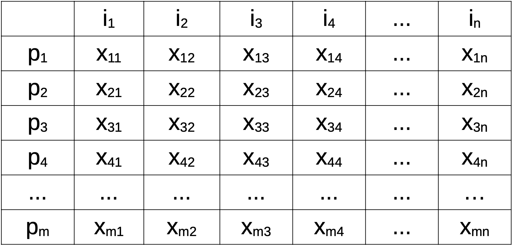
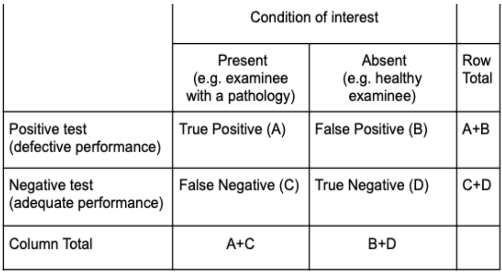

<!-- the section below is shown only if rendering is beamer from latex. (and format:revealjs is commmented) -->

::: {.content-visible when-format="beamer"}
```{=latex}
% TITLE SLIDES
\title{Metodi Statistici per la Neuropsicologia Forense\\ \vspace{1em} \small \emph{4b. Validità (formule)}}
\author{Giorgio Arcara,\\ Università di Padova \\ IRCCS San Camillo, Venezia}

\titlegraphic{

\vspace*{7cm}
\includegraphics[scale=0.15]{Figures/LogoSanCamilloIRCCS_Unipd_alpha.png}
\hfill \includegraphics[scale=0.15]{Figures/CC_license_3_0.png}
}
\maketitle
```
:::


# 4b. Validità (formule)

## Validità

\begin{center}
  \textbf{Tipi di validità}
\end{center}
\vspace{2em}

-  Validità di contenuto
- Validità convergente/divergente (validità di costrutto)
- Validità di criterio
- Validità di facciata
- Validità ecologica
\vspace{2em}

Esistono diverse classificazioni di validità. Questa che sto utilizzando è principalmente basata su Urbina, 2004, Essentials of Psychological Testing.

# Validità di contenuto

## Validità di contenuto

**Validità di contenuto**: la proprietà degli item di essere sufficienti ed adeguati per valutare il costrutto di interesse.
\vspace{2em}

Calcolabile con il Metodo di Lawshe (1975). è un metodo per ottenere validità di contenuto di item e test totale, caratterizzato da 3 step:

**STEP 1)**: Si chiede degli esperti (panelist) di valutare ciascun item secondo queste possibilità:

- Essenziale
- Utile ma non essenziale
- Non necessario

## Validità di contenuto

Metodo di Lawshe (1975)
\vspace{1em}

**Step 2)**: si calcola per ogni item un Content Validity Ratio (CVR):

$$
CVR = \frac{n_e - \frac{N}{2}}{\frac{N}{2}}
$$

$$
\small
\begin{aligned}
n_e & = \text{numero di panelist (i.e. esperti) che dicono che quell’item è essenziale} \\
N & = \text{numero totale di panelist} \\
\end{aligned}
$$

Il CVR varia da -1 a 1, 0 se metà dei panelist dicono che è essenziale.

Ogni valore pari a 1 viene aggiustato a 0.99 (per comodità e per convenzione).

\underline{Nota: CVR si riferisce a ciascun item, non al test}

## Validità di contenuto

Metodo di Lawshe (1975)

```{=latex}
\begin{columns}
  \column{0.5\textwidth}
      \textbf{Step 3)}: Selezione degli item da mantenere. Ma quali?

  \column{0.5\textwidth}
    \begin{figure}
      \includegraphics[scale=0.25]{Figures/tab_lawshe.png}
    \end{figure}
\end{columns}
```

In alternativa si mantengono gli item in cui CVR>=0.78 (Polit, Becl, Owen, 2007)

## Validità di contenuto

Metodo di Lawshe (1975)

**Step 4 (opzionale)**: È possibile calcolare un valore per il test (**Content Validity Index**) che non è altro che la \underline{media} dei CVR di tutti gli items.

$$
CVI = 
\frac{
  \displaystyle
  \sum_{I_1}^{I_k}
  \left(
    \frac{
      n_e - \frac{N}{2}
    }{
      \frac{N}{2}
    }
  \right)
}{
  k
}
$$
$$
\small
\begin{aligned}
n_e & = \text{numero di panelist (i.e. esperti) che dicono che quell’item è essenziale} \\
N & = \text{numero totale di panelist} \\
k & = \text{numero degli item} \\
I & = \text{gli item che compongono il test} \\
\end{aligned}
$$

## Validità di contenuto

Note sul metodo di Lawshe (1975)

È interessante notare come il metodo risponde solo in parte alla domanda di validità di contenuto.

Il metodo di Lawshe mi dice se un dato item è appropriato per il test, ma non se il test contiene tutti gli item necessari per i suoi scopi (nell’articolo originale di Lawshe sono discussi alcuni esempi in cui gli item da cui si parte sono già stati definiti e il problema è identificare se sono appropriati).

La validità di contenuto, spesso non è considerata né riportata nei test (non è molto di moda).

## Validità di costrutto

**Validità di costrutto**: esprime quanto il test misura effettivamente il costrutto che
intende misurare, valutando la coerenza interna degli item oppure la correlazione con altri test.

La validità di costrutto è valutata in due maniere:

- valutando sei gli **item** misurano in maniera appropriata il costrutto.

- valutando se il **punteggio totale del test**[^1] misuri in maniera appropriata il costrutto (rappresenta correttamente il costrutto?).

[^1]: nella maggior parte dei casi, il punteggio totale si ottiene sommando gli items
(in alcuni casi facendo una media).

## Validità di costrutto

\begin{center}
  \textbf{Consistenza interna}
\end{center}
\vspace{2em}

Uno dei classici modi per vedere su tutti gli item di un test si comportano in maniera coerente è valutando la consistenza interna, tramite l’utilizzo di metriche come l’alpha di Cronbach. 

Questa però è spesso associata più all’affidabilità (vedi quindi slides su formule affidabilità).

## Validità di costrutto

\begin{center}
  \textbf{Analisi fattoriale}
\end{center}

\small
L’analisi statistica più comunemente utilizzata per valutare gli item è l’analisi fattoriale.

L’analisi fattoriale (nel contesto della teoria dei test) indaga se gli item di un test si comportano in maniera coerente, dimostrando che essi misurano uno stessa variabile latente (detto fattore).

Operativamente e per questi scopi l’analisi fattoriale viene condotta in una matrice $m x n$, dove $m$ sono gli item (in riga) ed $n$ sono i partecipanti (in colonna).

{width="50%" fig-align="center"}

## Validità di costrutto

\begin{center}
  \textbf{Analisi fattoriale}
\end{center}

Il risultato di un’analisi fattoriale è spesso una matrice di “loadings”, cioè quanto ciascun
item è correlato ad un determinato fattore.
\vspace{1em}

```{=latex}
\begin{columns}
  \column{0.5\textwidth}
    \begin{figure}
      \includegraphics[scale=0.25]{Figures/fattoriale2.png}
    \end{figure}

  \column{0.5\textwidth}
          
      \small
      Esistono delle rule-of-thumb per definire se un loading è significativo (Es. > 0.3 o 0.5 Oppure < -0.3 o -0.5)
      
      i = item
      
      F = fattore
      
      l = loading

\end{columns}
```

## Validità di costrutto


\begin{center}
  \textbf{Analisi fattoriale}
\end{center}
\vspace{1em}

In questo esempio gli item caricano su 2 fattori
\vspace{1em}

```{=latex}
\begin{columns}
  \column{0.3\textwidth}
    \begin{figure}
      \includegraphics[scale=0.4]{Figures/fattoriale3.png}
    \end{figure}

  \column{0.7\textwidth}
          
      \scriptsize
      Un primo fattore cattura una correlazione positiva tra gli item 1,2,3 che tendono avere punteggi correlati tra loro.\\
\vspace{1em}      
Un secondo fattore cattura una correlazione positiva tra gli item 4,5, che tendono ad avere punteggi correlati tra loro. \\
\vspace{1em}      
Questo è uno scenario ideale, in cui items "caricano" chiaramente in maniera distinta in specifici fattori.


\end{columns}
```


## Validità di costrutto

\begin{center}
  \textbf{Analisi fattoriale}
\end{center}
\vspace{1em}

In questo esempio gli item caricano su 2 fattori
\vspace{1em}

```{=latex}
\begin{columns}
  \column{0.3\textwidth}
    \begin{figure}
      \includegraphics[scale=0.25]{Figures/fattoriale4.png}
    \end{figure}

  \column{0.7\textwidth}
          
      \scriptsize
      Un primo fattore cattura una correlazione positiva tra gli item 2,3,4,5, che tendono avere punteggi tutti correlati tra loro.\\
\vspace{1em}
Un secondo fattore cattura una correlazione negativa di item 1 e 4 rispetto ad item 9. In sostanza quando sono alti i punteggi di 1 e 4 son obassi quelli di 5, e viceversa.\\
\vspace{1em}
Questo è uno scenario più complesso (e comune), il fatto che un item carichi su pià fattori ("cross loadings") può essere indice che l'item non è adeguato o che il modello teorico va rivisto.

\end{columns}
```

## Validità di costrutto

\begin{center}
  \textbf{Analisi fattoriale}
\end{center}
\vspace{2em}

Esistono due tipi principali di analisi fattoriale.

L’**analisi fattoriale esplorativa**, ha come scopo cercare di definire qual è la struttura fattoriale che meglio descrive (se esiste) la relazione tra items.

L’**analisi fattoriale confermativa**, ha come scopo verificare se gli item si comportano in maniera conforme ad una struttura fattoriale nota.

## Validità di costrutto

\begin{center}
  \textbf{Analisi fattoriale}
\end{center}
\vspace{2em}

Nel contesto della validità di costrutto l’analisi fattoriale può essere una tecnica utilizzata per selezionare gli item che comporranno gli item del test finale (ad esempio escludendo quelli che non si comportano in maniera adeguata rispetto al costrutto o ai costrutti che si intendeva misurare).

Ad esempio, se un test intende misurare un singolo costrutto e tutti gli item eccetto uno hanno loading alti in un fattore, probabilmente quell’item andrebbe eliminato dalla versione finale del test.

## Validità di costrutto

\begin{center}
  \textbf{Analisi fattoriale}
\end{center}
\vspace{2em}

Esistono molte analisi statistiche e metriche per valutare la bontà di un’analisi fattoriale.

Tra i più comuni si usa il test di Goodness-of-Fit (è un test che riporta Chi-quadro) che deve essere **non significativo (p > 0.05)**. Se significativo vuol dire che la struttura a fattori proposta non è sufficiente per spiegare la variabilità dei dati.

Altre metriche sono il **RMSEA** (root Mean squared error of Approximation) che deve essere il più basso possibile (di solito <0.06 è considerata una soglia minima).

## Validità di costrutto

\begin{center}
  \textbf{Analisi fattoriale}
\end{center}
\vspace{1em}

```{=latex}
\begin{columns}
  \column{0.4\textwidth}
  
    L’analisi fattoriale è spesso rappresentata in maniera grafica distinguendo i fattori latenti (in questo caso cerchi) dalle variabili osservate (in questo caso quadrati).

  \column{0.6\textwidth}
    \begin{figure}
      \includegraphics[scale=0.4]{Figures/fattoriale5.png}
    \end{figure}
    
    \small
      \href{https://lavaan.ugent.be/tutorial/cfa.html}{\underline{https://lavaan.ugent.be/tutorial/cfa.html}}

\end{columns}
```

## Validità di costrutto

\begin{center}
  \textbf{Analisi fattoriale}
\end{center}
\vspace{1em}

Per interpretare se un’analisi fattoriale supporta effettivamente la validità di costrutto, andrebbe visto se gli item si comportano effettivamente come il test assume si dovrebbero comportare.

Es. se un test sostiene di misurare un costrutto specifico (es. Attenzione visuospaziale) tutti gli item dovrebbero caricare su un solo fattore (almeno principalmente).

È innanzitutto utile vedere se gli autori di un test hanno effettuato analisi fattoriale per indagare la relazione tra gli item e li hanno selezionati (escludendone alcuni) o in generale se c’è stata una qualche fase di selezione degli items (es. item selection tramite correlazione).

## Validità di costrutto

\begin{center}
  \textbf{Analisi fattoriale}
\end{center}
\vspace{1em}

Stabilire l’adeguatezza di un’analisi fattoriale non è comunque semplice perché spesso è possibile fare giustificazioni solo a posteriori dei risultati finali, senza che i risultati abbiano influenzato la scelta se tenere o meno degli items.

Ad esempio, potrei avere un test che assume di misurare uno specifico costrutto, trovare con un’analisi fattoriale esplorativa che in realtà la variabilità degli item è spiegata da *due* fattori e mantenere comunque tutti gli item dicendo che probabilmente sono influenzati da due fattori separati, coerenti con aspettative da teoria (Es. Attenzione visuospaziale e funzioni esecutive).

## Validità di costrutto

\begin{center}
  \textbf{Analisi fattoriale}
\end{center}
\vspace{2em}

Nota che a volte l’analisi fattoriale è usata anche per i punteggi di sottoscale che compongono una batteria (es. Per APACS, Arcara & Bambini 2016).

I principi sono gli stessi, ma in questo caso non si tratta di items, ma di gruppi di items che compongono sottoscale (in questo caso es. il task di Linguaggio Figurato 1, il task di Linguaggio Figurato 2 etc.).

## Validità di costrutto

\begin{center}
  \textbf{Principal Component Analysis (PCA)}
\end{center}

\small
PCA e analisi fattoriale sono concettualmente simili e i risultati (una matrice di loadings) sono anch’essi simili. La differenza è che nella PCA non c’è stima di “variabili latenti”, ma lo scopo è *ottenere nuove variabili che catturano porzioni di varianza comune tra più punteggi* (es. items, o punteggi totali di test). Tali variabili sono dette **componenti principali** (da cui il nome dell’analisi).
Questa differenza si riflette in una diversità a livello della formula e nei risultati che si
otterranno.

Quindi potreste trovare in un test una PCA invece di un’analisi fattoriale. Potete interpretarle in maniera analoga, anche se sarebbe più corretto utilizzare l’analisi fattoriale perchè assume l’esistenza di variabili latenti, cosa che è spesso implicita quando si tratta di item o punteggi totali di test psicologici.

## Validità di costrutto

\begin{center}
  \textbf{Nota Analisi Fattoriale e PCA}
\end{center}

\small
Analisi fattoriale e PCA ci aiutano a capire come si raggruppano gli items e se lo fanno in maniera coerente con il costrutto (o i costrutti) che dovrebbero misurare.

Non ci garantiscono però che il costrutto sia quello giusto e pertanto sono solo un’informazione parziale sulla validità.

Ad esempio, immaginiamo che voglia valutare validità di costrutto di un test di memoria. Gli autori potrebbero riportare un’analisi fattoriale che mostra che gli item correlano bene fra di loro e sono riconducibili a un’unica variabile latente. Questo è ottimo ma *non mi garantisce che questa variabile latente sia effettivamente la memoria*. 
Il test potrebbe essere stato costruito in maniera sbagliata e gli item essere consistenti per un altro motivo (es. magari il test cattura perlopiù velocità psicomotoria).

## Validità di costrutto

\begin{center}
  \textbf{Correlazione}
\end{center}

Lo strumento più comune per verificare la validità di costrutto di un test è indagare la correlazione del punteggio totale al test con correlazione dei punteggi ad altri test.

Non esiste una regola di quanto dovrebbe essere almeno questa correlazione, ma è ragionevole pensare che debba essere almeno moderata (> 0.3), ma verosimilmente anche di più.

I test neuropsicologici (specie nei sani) tendono sempre ad essere **molto correlati fra di loro** e correlazioni più alte sono attese (di fatto queste correlazioni hanno portato ad ipotizzare al cosiddetto fattore g dell’intelligenza)

[[https://en.wikipedia.org/wiki/G_factor_(psychometrics)]{.underline}](https://en.wikipedia.org/wiki/G_factor_(psychometrics))

## Validità di costrutto

\begin{center}
  \textbf{Correlazione}
\end{center}
\vspace{1em}

```{=latex}
\begin{columns}
  \column{0.5\textwidth}
    \begin{figure}
      \includegraphics[scale=0.3]{Figures/correlazione.png}
    \end{figure}

  \column{0.5\textwidth}
    Questa figura riporta le correlazioni tra alcuni test del NADL (Semenza et al., 2014) e il NADL-F (Arcara et al., 2019).

\end{columns}
```

## Validità di costrutto

\begin{center}
  \textbf{Correlazione}
\end{center}
\vspace{2em}

L’aspetto critico dell’interpretare valori “soglia” di correlazioni tra due diversi test è che i valori sono anche legati ai rispettivi errori dei test (quindi ad aspetti legati a numerosità campionarie e affidabilità, vedi future slides).

Inoltre è sempre possibile “giustificare” a posteriori un’eventuale differenza o valore basso (es. La correlazione è bassa presumibilmente perchè questo test implica di più le funzioni esecutive rispetto all’altro).

## Validità di costrutto

\begin{center}
  \textbf{Correlazione}
\end{center}
\vspace{2em}

Anche l’assenza di correlazione o correllazione molto bassa può essere usata a sostegno di una buona validità di costrutto.

In generale la validità di costrutto indica quanto bene stiamo misurando lo specifico costrutto. 

Dimostrare che stiamo isolando bene la specifica funzione cognitiva è a sostegno della validità di costrutto.

## Validità di costrutto

\begin{center}
  \textbf{Correlazione}
\end{center}
\vspace{1em}

```{=latex}
\begin{columns}
  \column{0.5\textwidth}
    \begin{figure}
      \includegraphics[scale=0.25]{Figures/correlazione2.png}
    \end{figure}

  \column{0.5\textwidth}
  \small
   Questa figura riporta le correlazioni tra alcuni test di vario tipo e il NADL-F (Arcara et al., 2019).
   
   Notate che non correla con GDS (geriatric Depression Scales), a sostegno della sua validità di costrutto.

\end{columns}
```

## Validità di costrutto

\begin{center}
  \textbf{Altre analisi}
\end{center}

\small
In generale la validità di costrutto non è vincolata a specifiche analisi statistiche e andrebbe valutata rispetto alla specifica domanda a cui cerca di rispondere. In altre parole, piuttosto che cercare nei manuali / articoli specifiche analisi (es. È stata fatta analisi fattoriale? Ci sono correlazioni?), dovreste cercare di rispondere a questa domanda:

*Esistono evidenze sperimentali che suggeriscono che il test stia misurando quello che intende misurare?*

Ad esempio un test che ha come obiettivo valutare la capacità di lavorare potrebbe non avere nessuna correlazione con altri test, ma essere buono nel discriminare persone che sono state licenziate, da quelle che hanno mantenuto il lavoro (in questo caso una regressione logistica o altre analisi più legate alla discriminazione).

## Validità di costrutto

\begin{center}
  \textbf{Altre analisi}
\end{center}
\vspace{1em}

Esempio da Kershaw & Webber, 2008
\vspace{1em}

```{=latex}
\begin{columns}
  \column{0.5\textwidth}
    \begin{figure}
      \includegraphics[scale=0.4]{Figures/FCAI.png}
    \end{figure}

  \column{0.5\textwidth}
   Il FCAI è un test per valutazione competenze finanziarie. Per dimostrare validità di costrutto sono stati confrontati partecipanti con e senza tutore legale (tramite MANOVA).

\end{columns}
```

## Validità di costrutto

\begin{center}
  \textbf{Altre analisi}
\end{center}

\small
È possibile anche combinare analisi precedentemente citate per supportare validità di costrutto.

Ad esempio Montemurro et al. (2023) per dimostrare che il test Tele-GEMS era utile per valutare cognizione generale hanno usato il seguente approccio:

1) raccolto dati su pazienti (Sclerosi Multipla in quel caso), su vari test.

2) fatto PCA su questi test e ottenuto un punteggio globale (prima componente) che catturava il 60% della varianza.

3) visto se punteggio Tele-GEMS correlava con questo punteggio. La correlazione era 0.50 (moderata/alta) e interepretata a supporto di una buona validità di costrutto del test.

## Validità di costrutto

\begin{center}
  \textbf{Altre analisi}
\end{center}
\vspace{2em}

Un altro ipotetico esempio su come combinare analisi per validità di costrutto:

Se l’analisi fattoriale mostra che gli item si comportano come se catturassero due variabili latenti, una associata ad attenzione ed una a memoria, sarebbe utile e a supporto di validità di costrutto se i punteggi ottenuti sommando queste due parti correlassero rispettivamente con un altro test di attenzione ed un altro test di memoria.

## Considerazione in interim

Un potenziale modo di risolvere questo problema della flessibilità nelle analisi di validità di costrutto potrebbe essere quello di *pre-registrare* le analisi e i risultati attesi per considerare una buona validità di costrutto. Vedi questo [link](https://en.wikipedia.org/wiki/Preregistration_(science)) per approfondimenti.

Nota che pre-registrare risolve _in generale_ problemi di flessibilità o non chiarezza delle analisi.


# Validità di criterio

## Validità di criterio

La **validità di criterio** valuta quanto un test è associato o predice un altra variabile di outcome (osservabile), detta gold-standard.

Le analisi che si possono utilizzare e come valutare i risultati cambiano a seconda che il criterio sia una variabile continua (es. Il punteggio ad un altro test) oppure una variabile categoriale (es. l’appartenza ad un gruppo, es MCI vs Controlli).


## Validità di criterio

La validità di criterio può essere divisa in concorrente o predittiva (vedi slides Validità e affidabilità (teoria), ma questo non cambia il modo in cui vengono fatte generalmente le analisi, che dipendono solo dal fatto che il criterio sia variabile continua o categoriale.


## Validità di criterio

\begin{center}
  \textbf{Variabile continua}
\end{center}

Se il gold standard è una variabile continua, allora si può vedere tramite una correlazione. In tal caso la correlazione dovrebbe essere molto alta (> 0.9).

A partire dalla correlazione possiamo calcolare la varianza spiegata (nota anche come $r^2$) che non è altro che il coefficiente di correlazione al quadrato.

A volte per calcolare la validità di criterio si usa la regressione lineare. Nel caso di due variabili la regressione lineare è strettamente imparentata con il coefficiente di correlazione (e infatti i risultati di alcuni aspetti sono matematicamente identici).

## Validità di criterio

\begin{center}
  \textbf{Variabile categoriale}
\end{center}

\small
Nel caso di variabili categoriali (Es. sopra/sotto cut-off, oppure MCI vs Controlli), esistono famiglie di analisi diverse che vengono utilizzate. La categoria più rilevante (spesso patologica) è detta anche condizione di interesse.

In questa fase diciamo solo che esistono 4 tipi di possibili risultati quando si confronta un test con il suo criterio (categoriale)

{width="50%" fig-align="center"}

## Validità di criterio

\begin{center}
  \textbf{Variabile categoriale}
\end{center}
\vspace{2em}

{width="50%" fig-align="center"}

Tutte le metriche legate a questo fanno parte dei concetti di Sensibilità/Specificità che saranno trattate in apposite lezioni (dopo i cut-off)

## Validità di criterio o di costrutto?

Nota che se l'interesse è nel misurare un costrutto psicologico (es. memoria, attenzione) sarebbe più pertinente parlare di **validità di costrutto** e usare per valutarla i metodi discussi. La misurazione è su un concetto inosservabile.

In ambito neuropsicologico/psicologico raramente il punteggio ad un altro test è da considerare un criterio ma ci sono eccezioni comuni:

- si vuole mostrare che un test breve è equivalente ad uno lungo/dispendioso (quello lungo è il "criterio")

- si vuole mostrare che un test online è equivalente ad uno in presenza (valutazoini in presenza sono di norme considerate gold standard)


# Validità di facciata

## Validità di facciata

La **validità di facciata** valuta quanto un test *sembra* misurare ciò che intende misurare.
\vspace{2em}

```{=latex}
\begin{columns}
\column{0.8\textwidth}
\small
Spesso è valutata tramite domande ad hoc ad esperti o tramite confronto con test gold standard esistenti, ma solo tramite confronto qualitativo.

Talvolta la sola informazione che si ha a disposizione di un test è proprio la validità di facciata. Non ci sono altre prove che il test misuri ciò che vuole misurare se non il fatto che sia costruito da item che plausibilimente misurano proprio quel costrutto. 

\column{0.2\textwidth}
\begin{figure}
\includegraphics[scale=0.05]{Figures/triangle.png}
\end{figure}
\end{columns}
```

## Validità di facciata in ambito forense

La validità di facciata può essere importante per assicurarsi collaborazione del paziente e, in contesto forense, anche che non psicologi (es. il giudice) accettino le conclusioni tratte.

I test per identificare potenziali simulatori ovviamente non devono avere validità di facciata (anzi, il fatto che abbiano questo scopo non dovrebbe essere evidente).


# Validità ecologica

## Validità ecologica

La **validità ecologica** valuta quanto un test è in grado di prevedere comportamenti al di fuori del setting di valutazione (quindi nella vita quotidiana).

Spesso è studiata tramite correlazioni con altre scale riferite a comportamenti della vita quotidiana (diversamente da molti test l’interesse non è in costrutti ma in *altri comportamenti*).

Può essere anche essere valutata tramite altre analisi, purché mostrino che i punteggi al test siano associati al fenomeno di vita quotidiana di interesse.

## Validità ecologica

Ad esempio un test potrebbe indagare la correlazione tra il punteggio ad un test di funzioni esecutive e il numero di comportamenti antisociali che un paziente ha mostrato durante un ricovero, per supportare che le informazioni del test sono associati a comportamenti legati alle funzioni esecutive nella vita quotidiana.
